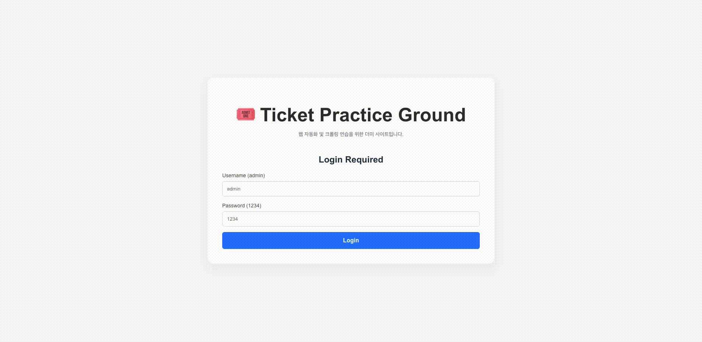

# Dummy Ticketing Site

이 프로젝트는 Go 백엔드와 React 프론트엔드로 구성된 브라우저 자동화 테스트를 위한 예매 사이트 예제입니다. Makefile을 통해 개발 및 빌드 작업을 간편하게 수행할 수 있습니다.

## Preview


## 사용 예시

```sh
# 의존성 설치
make setup

# 개발 서버 실행 (백엔드 & 프론트엔드)
make dev

# 배포용 빌드
make build

# 프로젝트 구조 확인
make tree

# 전체 정리
make clean
```

## 배포 파일 안내

이 저장소에는 주요 OS/아키텍처(darwin_arm64, darwin_amd64, windows_amd64, linux_amd64)용 실행 파일이 함께 제공됩니다.

아무런 의존성 설치 없이, 본인 OS에 맞는 파일만 실행하면 바로 서버를 사용할 수 있습니다.

예시:
- macOS(Apple Silicon): `./dummy-ticketing-site_darwin_arm64`
- macOS(Intel): `./dummy-ticketing-site_darwin_amd64`
- Windows: `dummy-ticketing-site_windows_amd64.exe`
- Linux: `./dummy-ticketing-site_linux_amd64`

## 참고
- 프론트엔드 디렉토리: `frontend/`
- 백엔드 진입점: `main.go` 또는 `cmd/main.go`
- pnpm이 필요합니다. (프론트엔드)
- Go 1.18+ 권장

자세한 명령어 설명은 `make help`로 확인하세요.
